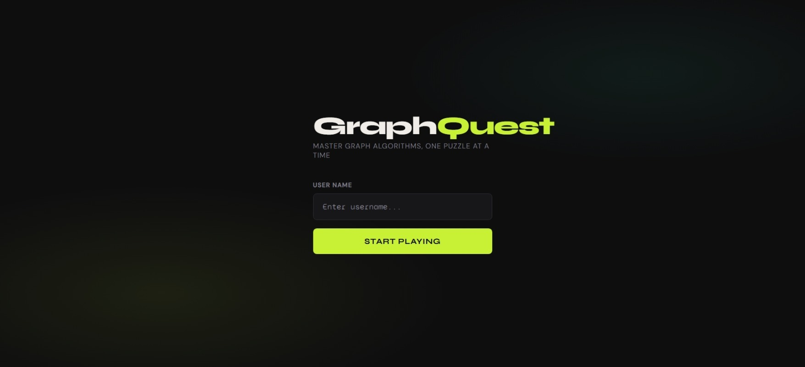
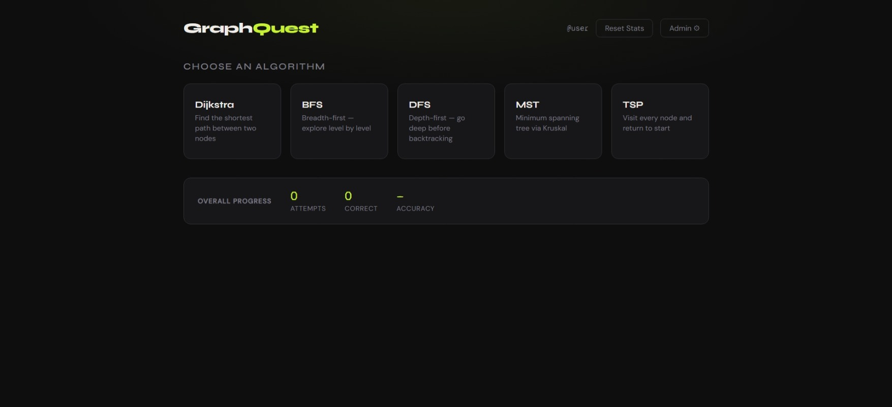
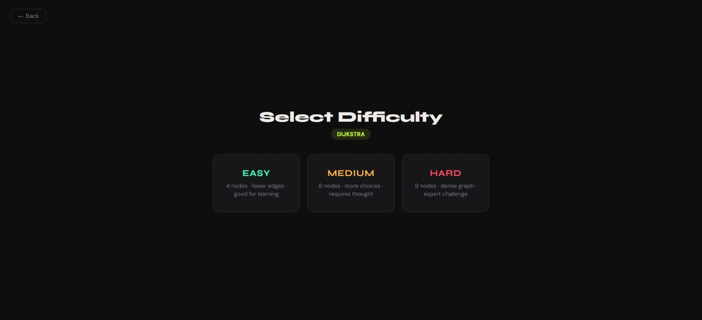
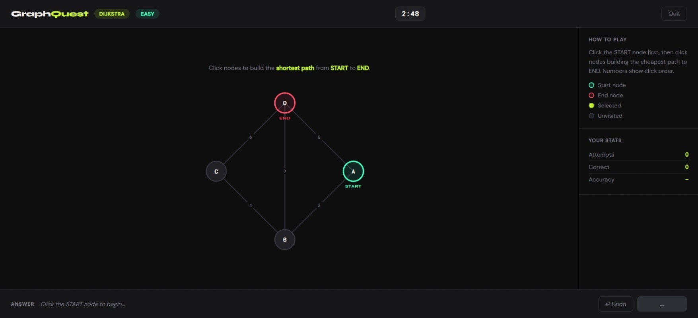
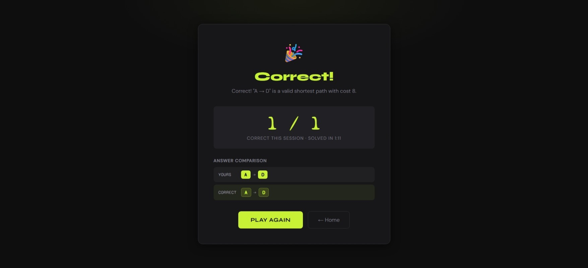
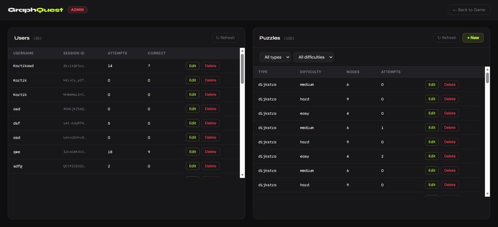

# GraphQuest

**Authors:** Hanish Mehla, Kartik Sharma
**Class:** [CS 5610 Web Development Spring 2026](https://johnguerra.co/classes/webDevelopment_online_spring_2026/)

---

## Project Objective

GraphQuest is a browser-based puzzle game where you solve graph algorithm challenges against a timer. Pick an algorithm — Dijkstra, BFS, DFS, MST, or TSP — click through the graph to build your answer and submit. The backend validates your solution and shows you the Results.

No hints. No hand-holding. Just you and the graph.

---

## Screenshot








---

## Getting Started

**1. Clone the repo**
```bash
git clone https://github.com/HanishMehla/GraphQuest.git
cd GraphQuest
```

**2. Install dependencies**
```bash
npm install
```

**3. Set up environment variables**

Create a `.env` file in the root:
```
MONGO_URI=your_mongodb_connection_string
SESSION_SECRET=string
```

**4. Start the server**
```bash
node server.js
```

Open `http://localhost:3000` in your browser.

---

## Live Demo

[Demo](https://graphquest100.onrender.com/)